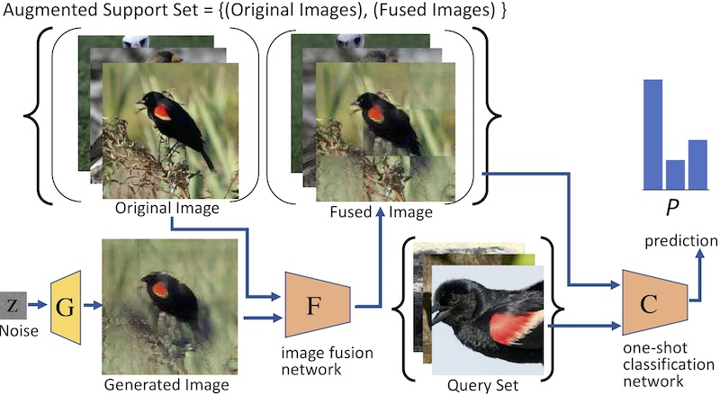
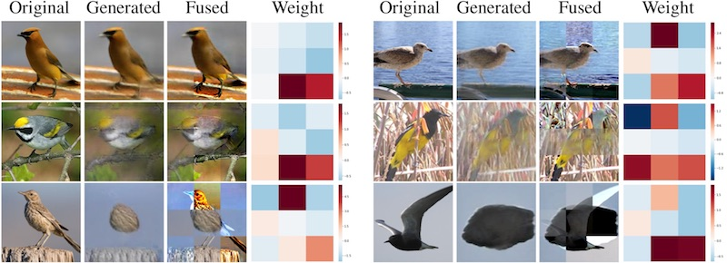

# MetaIRNet

This is the official implementation of our papers.
- Meta-Reinforced Synthetic Data for One-Shot Fine-Grained Visual Recognition (NeurIPS 2019)
- Satoshi Tsutsui, Yanwei Fu, and David Crandall. (2022). Reinforcing Generated Images via Meta-learning for One-Shot Fine-Grained Visual Recognition. IEEE Transactions on Pattern Analysis and Machine Intelligence (PAMI). Accepted, To Appear. 
- Satoshi Tsutsui, Yanwei Fu, and David Crandall. (2019). Meta-Reinforced Synthetic Data for One-Shot Fine-Grained Visual Recognition. Advances in Neural Information Processing Systems (NeurIPS).
 
Project Page: http://vision.soic.indiana.edu/metairnet/

We introduce an effective way to employ an ImageNet-pre-trained image
generator for the purpose of improving fine-grained one-shot
classification when data is scarce. As a way to fine-tune the
pre-trained generator, our pilot study finds that adjusting only scale
and shift parameters in batch normalization can produce a visually
realistic images. This way works with a single image making the method
less dependent on the number of available images. Furthermore,
although naively adding the generated images into the training set
does not improve the performance, we show that it can improve the
performance if we properly mix the generated images with the original
image. In order to learn the parameters of this mixing, we adapt a
meta-learning framework.
 We implement this idea and demonstrate a consistent and significant
improvement over several classifiers on two fine-grained benchmark
datasets.

  
Our Meta Image Reinforcing Network (MetaIRNet) has
 two modules: an image fusion network, and a one-shot classification
 network. The image fusion network reinforces generated
 images to try to make them beneficial for the one-shot classifier, while the
 one-shot classifier learns representations that are suitable to
 classify unseen examples with few examples. Both networks
 are trained by end-to-end, so the loss back-propagates from
 classifier to the fusion network.


  
We show samples of original image, generated image, fused image,  and mixing weight. 
Higher weight (red) means more original image used, and lower weight (blue) means more generated image used.

If you find this code useful, please consider to cite the following paper. 
```
@inproceedings{metasatoshi19,
    author={Satoshi Tsutsui, Yanwei Fu, David Crandall},
    booktitle	= {Advances in Neural Information Processing Systems (NeurIPS)},
    title = {{Meta-Reinforced Synthetic Data for One-Shot Fine-Grained Visual Recognition}},
    year = {2019}
}
```

# Environment
- python 3.6
- pytorch 1.0.1 
    - Please stick to this particular version!  There's some compatibility issues with another version.
- numpy, scipy, pandas, tqdm, scikit-learn, requests, and accimage. 

## option 1:  install on your own enviroment
You can install Anaconda (or Miniconda) and then install the following packages.
```
conda install -y ipykernel numpy scipy matplotlib pandas tqdm opencv pillow scikit-learn requests
conda install -y pytorch==1.0.1 torchvision cudatoolkit=9.0 -c pytorch
conda install -y -c conda-forge accimage
```
## option 2: replicate my environment 
[`env.yml`](./env.yml) is basically the exact environment of mine. Let's create a conda environment and replicate the envorinment as follows.
```
conda deactivate
conda create  -y  --name=satoshi python=3.6.5
conda activate satoshi
conda env update -f env.yml
```

# Dataset
## CUB dataset
- download the dataset from http://www.vision.caltech.edu/visipedia/CUB-200-2011.html
- put it as `./data/cub`
```
wget http://www.vision.caltech.edu/visipedia-data/CUB-200-2011/CUB_200_2011.tgz 
tar -xvzf CUB_200_2011.tgz 
mkdir ./data
mv CUB_200_2011 ./data/cub
rm -rf CUB_200_2011.tgz 
```
## NAB dataset
- download NAB dataset from http://dl.allaboutbirds.org/nabirds
- put it as ./data/nab
```
wget https://www.dropbox.com/s/nf78cbxq6bxpcfc/nabirds.tar.gz
tar -zxvf nabirds.tar.gz
mkdir ./data
mv nabirds. ./data/nab
rm -rf nabirds.tar.gz 
```

# Generate the images with pretrained GANs
- You need ImageNet pretrained 128 x 128 BigGAN weights from the BigGAN [author's repository](https://github.com/ajbrock/BigGAN-PyTorch). 
- The pretrained model is available on Google Drive: https://drive.google.com/open?id=1nAle7FCVFZdix2--ks0r5JBkFnKw8ctW
    - Unzip it, and put `G_ema.pth` to `./data/`
```
python download_gdrive.py 1nAle7FCVFZdix2--ks0r5JBkFnKw8ctW BigGAN_ch96_bs256x8_138k.zip
mkdir ./data
unzip BigGAN_ch96_bs256x8_138k.zip
mv ./138k/G_ema.pth ./data/G_ema.pth
rm -rf BigGAN_ch96_bs256x8_138k.zip 138k
```

- Commands to generate images for each dataset
```
python generate_images.py --gpu 0 --dataset cub
python generate_images.py --gpu 0 --dataset nab
```
- For qucik trial, I uploaded the CUB generated images on Google Drive: https://drive.google.com/file/d/1HHmQ7VKx6jPlemhWIH9XCag3rWOy9zGm
    - put it udner `./data/`
```
python download_gdrive.py 1HHmQ7VKx6jPlemhWIH9XCag3rWOy9zGm cub-generated.tar
tar -xvf cub-generated.tar
mv cub-generated ./data/cub-generated
rm cub-generated.tar
```

# Pretrained models
Google Drive links for pretrained models:
- a pretrained model on CUB 1-shot-5-way on : https://drive.google.com/file/d/1HSQK6gG4WMLtDfljikQRffHqim0zTpUa
you can download with the following command:
```
python download_gdrive.py 1HSQK6gG4WMLtDfljikQRffHqim0zTpUa cub_nway-5_nshot-1_classifier-protonet_backbone-resnet18_mixer-fusion.model.pth
```

# Run the code
- Training on CUB on your own
```
python main.py --classifier protonet --mixer fusion --gpu 0
```
- Testing with the pretrained model on CUB
```
python main.py --classifier protonet --mixer fusion --epochs 0 --resume ./cub_nway-5_nshot-1_classifier-protonet_backbone-resnet18_mixer-fusion.model.pth --gpu 0
```
This should give you the accuracy of 0.84129.

# Acknowledgement
In addition to the acknowgement in the paper, I would like to thank these repositories where I borrowed some code. The borrowed part is mentioned in the comments. 
 - https://github.com/Clarifai/few-shot-ctm/blob/b482e8bb2b025584c866fdc06d1abdc8f99943f4/tools/download_gdrive.py
 - https://github.com/nogu-atsu/small-dataset-image-generation
 - https://github.com/facebookresearch/mixup-cifar10/blob/eaff31ab397a90fbc0a4aac71fb5311144b3608b/train.py
 - https://github.com/oscarknagg/few-shot
 - https://github.com/wyharveychen/CloserLookFewShot/
 - https://github.com/ajbrock/BigGAN-PyTorch/
